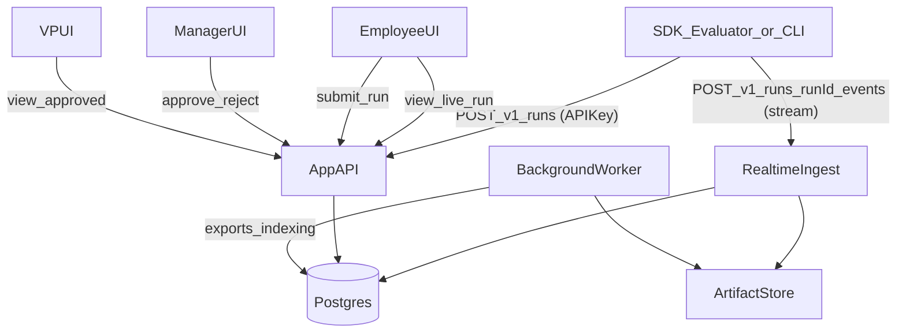

# Standalone Deployed Web App Plan (SSO-ready)

## Current state (what the repo does today)

- **Execution**: `llm_eval/cli.py` runs tasks locally via `llm_eval/core/evaluator.py`.
- **Storage**: results are persisted as **CSV/JSON/XLSX** under `llm-eval_results/…` via `llm_eval/core/results.py`.
- **Live UI (local today)**: a lightweight local web UI server (`llm_eval/server/app.py`) exposes `/api/run`, `/api/snapshot`, and SSE to show progress for a single in-flight run.
- **Historical dashboard**: `llm_eval/server/dashboard_server.py` serves a static dashboard (`llm_eval/_static/dashboard/*`) and reads historical runs from the filesystem via `llm_eval/core/run_discovery.py`.
- **“Publish”**: dashboard can “publish to Confluence” and tracks published run IDs in a local file `.published_runs.json` (not a true multi-user approval system).

## Target product requirements (mapped to concrete capabilities)

### Identity & users

- **Users**: profile page, group membership, role (Manager / GM / VP), API key management.
- **SSO**: not required for MVP in a trusted network, but implement an auth layer that can later support:
- Reverse-proxy header auth (common in air-gapped setups)
- OIDC or SAML (once you know what your SSO is)
- **Bootstrap (MVP)**: add an initial admin bootstrap mechanism (e.g., `ADMIN_BOOTSTRAP_TOKEN`) so the first admin user/org chart can be created safely even without SSO.

### Org visibility rules

- **Hierarchy**: every user is an employee node; visibility is by “subtree” (direct + indirect reports).
- **Roles**:
- **Employee**: can create/upload runs and submit for approval; sees own runs and their status.
- **Manager**: sees runs for their subtree; can approve/reject.
- **GM/VP**: sees only **approved** runs for their subtree.

### Workflow

- **States**: `DRAFT` → `SUBMITTED` → `APPROVED` (or `REJECTED`).
- **Actions**:
- Employee: upload run + submit.
- Manager: approve/reject with comment.
- GM/VP: browse/search/export approved runs.

### Data ingress/egress

- **Upload from platform**: upload a CSV/JSON/XLSX results artifact; platform ingests into DB and keeps the raw file.
- **Export per run**: download CSV/JSON/XLSX from the platform.
- **Ingestion API**: send run results from anywhere using per-user API keys.
- **Remote live streaming (chosen)**: while a run is executing, the SDK streams progress/events to the deployed platform and the “live run dashboard” is served by the platform.

---

## Architecture (recommended default for air-gapped, with remote live streaming)

### High-level components

- **Backend**: FastAPI (new) + PostgreSQL + background worker/queue.
- **Frontend**: reuse and extend the existing static dashboard UI (`llm_eval/_static/dashboard/*`) to avoid Node toolchains in an air-gapped network.
- **Realtime ingestion**: accept SDK run events over HTTP streaming (NDJSON) or WebSocket and update the live run state.
- **Storage**:
- Postgres stores canonical entities (users, org, runs, approvals, items, metrics).
- Object storage (S3-compatible like MinIO) or filesystem volume stores raw uploaded artifacts.

### Suggested repo layout changes

- Keep `llm_eval/` as the SDK.
- Add a new deployable service package:
- `llm_eval_platform/` (new): FastAPI app, auth, DB models, migrations, API routes, services.
- Add deployment assets:
- `docker/` (new): `Dockerfile`, `docker-compose.yml` (API + worker + postgres + redis/minio).
- `helm/` (optional): Kubernetes chart for internal deployment.

### Mermaid: runtime flow (remote live streaming + approval)

---

## Data model (new)

### Core tables

- **users**: `id(uuid)`, `email`, `display_name`, `title`, `status`, timestamps.
- **user_identities** (SSO-ready): `user_id`, `provider`, `subject`, `email`, `raw_claims`.
- **org_edges**: `manager_id`, `employee_id`, `effective_from`, `effective_to`.
- **org_closure** (recommended): precomputed ancestor/descendant pairs for fast subtree authorization (or a materialized path).
- **roles**: enum `{EMPLOYEE, MANAGER, GM, VP}` stored on `users` or via join table.
- **api_keys**: `id`, `user_id`, `name`, `hash`, `prefix`, `created_at`, `revoked_at`, `scopes`.

### Run/approval tables

- **runs**: `id(uuid)`, `external_run_id` (client-provided), `created_by`, `owner_user_id`, `task`, `dataset`, `model`, `metrics[]`, `run_metadata(json)`, `run_config(json)`, `status`, timestamps.
- **run_items**: `run_id`, `item_id`, `input(json/text)`, `expected(json/text)`, `output(json/text)`, `latency_ms`, `trace_id`, `trace_url`, `error`.
- **run_item_scores**: `run_id`, `item_id`, `metric_name`, `score_numeric`, `score_raw(json)`, `meta(json)`.
- **approvals**: `run_id`, `submitted_by`, `submitted_at`, `decision_by`, `decision_at`, `decision` (APPROVED/REJECTED), `comment`.
- **audit_logs**: append-only: actor, action, entity, before/after, timestamp.
- **run_events** (optional): append-only event log for debugging/replay; not required if you always normalize into the tables above.

### Enforcement strategy

- Build a reusable **Authorization service** (policy layer) that answers:
- “Can user X view run Y?”
- “Can user X approve run Y?”
- Enforce subtree visibility using `org_closure` (or equivalent) + run ownership + run state (GM/VP approved-only).

---

## API design (new)

### Authentication

- **MVP**:
- UI: optional `X-User` / `X-Email` header (reverse proxy) OR a simple internal session guarded by trusted network + `ADMIN_BOOTSTRAP_TOKEN` (for initial admin creation).
- API: `Authorization: Bearer <api_key>` (scoped).
- **Later SSO**: add OIDC or SAML provider and map identities into `user_identities`.

### Core endpoints (versioned)

- **Ingestion**:
- `POST /v1/runs` create run (metadata) and return `run_id` + `live_url`
- `POST /v1/runs/{run_id}/events` stream RunEventV1 (NDJSON) OR WebSocket `WS /v1/runs/{run_id}/ws`
- `POST /v1/runs/{run_id}/items` bulk add items (offline/backfill)
- `POST /v1/runs:upload` multipart upload CSV/JSON/XLSX for ingestion
- **Browsing**:
- `GET /v1/runs` filters: task/model/dataset/date/status/owner
- `GET /v1/runs/{id}` details + aggregates
- `GET /v1/runs/{id}/export?format=csv|json|xlsx`
- `POST /v1/runs/compare` (or `GET` with ids)
- **Workflow**:
- `POST /v1/runs/{id}/submit`
- `POST /v1/runs/{id}/approve`
- `POST /v1/runs/{id}/reject`
- **Users/org**:
- `GET /v1/me`, `GET /v1/me/api-keys`, `POST /v1/me/api-keys`, `DELETE /v1/me/api-keys/{id}`
- Admin: `POST /v1/admin/users`, `POST /v1/admin/org/import` (CSV)

---

## Streaming contract (RunEventV1) (new, critical)

- **Transport**: newline-delimited JSON (“NDJSON”) over HTTP POST, or WebSocket messages.
- **Idempotency**: include `event_id` (uuid) and `sequence` (monotonic per run) so the platform can dedupe/reorder.
- **Event types (minimum)**: `run_started`, `item_started`, `item_completed`, `metric_scored`, `item_failed`, `run_completed`.
- **Payload mapping**: keep it aligned with existing SDK concepts (`EvaluationResult`, `ProgressTracker` snapshots) to minimize transformation.
- **Versioning**: `schema_version: 1` on every event; platform supports `v1` long-term and can introduce `v2` later.

---

## SDK ↔ Platform integration (chosen behavior)

### Default behavior

- SDK uses a `PlatformClient` to:
- create a remote run on start
- stream events during evaluation
- finalize the run and (optionally) upload the raw CSV/XLSX artifact as an attachment
- The SDK prints one web URL for the user: the platform `live_url`.

### Local live UI deprecation

- Keep `llm_eval/server/app.py` as a fallback mode (e.g., `--live-mode local`) for troubleshooting.
- Default (`--live-mode platform`) uses the remote platform dashboard.

## UI/UX proposal (how it will look)

### Navigation

- **Runs** (default): the existing analytics dashboard becomes the main page.
- **Upload**: drag/drop file upload + metadata form.
- **Approvals** (Managers only): queue of `SUBMITTED` runs + quick approve/reject.
- **My Profile**: user info + role + org path + API keys.
- **Admin** (optional): manage users/org, bulk import.

### Runs page (adapt existing dashboard)

- Add a **Status filter** replacing/expanding today’s “Published/Unpublished”:
- `Draft`, `Submitted`, `Approved`, `Rejected`.
- Row actions:
- Employee: **Submit** (if draft), **Export**, **Delete** (if allowed).
- Manager: **Review** (opens approval panel), **Export**.
- GM/VP: **Export** only.

### Run details

- Reuse the existing per-run UI table style (rows with metrics, trace id) but load from DB.
- Add a right-side panel:
- **Status badge** + submitted-by + timestamps
- If Manager and run is `SUBMITTED`: Approve/Reject + comment
- If run is executing: show **Live** state (streaming updates) using the same UI, driven by platform state.

### Upload page

- Step 1: upload artifact (CSV/JSON/XLSX)
- Step 2: map columns (if needed) + preview
- Step 3: save as `DRAFT` and optionally submit

---

## What needs to change in the existing codebase

### Replace filesystem-based “truth” with DB-backed runs

- `llm_eval/core/run_discovery.py` becomes a **legacy importer** (reads existing `llm-eval_results` once and ingests into DB).
- `llm_eval/server/dashboard_server.py` evolves from a `http.server` static file server into a real web backend (or is replaced by `llm_eval_platform/app.py`).

### Keep and reuse existing UI assets

- Continue serving:
- `llm_eval/_static/dashboard/*` as the analytics UI
- `llm_eval/_static/ui/*` as the run-details UI
- Update the JS to call the new API endpoints (minimal changes because it already uses a `BASE_URL`-aware `apiUrl()` helper).

### Add an SDK-to-platform submission + streaming path (updated)

- Add `llm_eval/platform_client.py` (new) + CLI command:
- `llm-eval submit --file results.csv --server https://... --api-key ...`
- Default streaming during execution: evaluator calls platform APIs and streams RunEventV1.
- Update `llm_eval/core/evaluator.py` to set `result.html_url` to the platform run page (instead of `http://127.0.0.1:<port>/`) when `--live-mode platform`.

---

## Deployment plan (internal)

- Provide `docker-compose.yml` for:
- API (FastAPI)
- Worker (same codebase)
- Postgres
- Redis (queue)
- Optional MinIO
- Provide configuration via env vars:
- `DATABASE_URL`, `REDIS_URL`, `ARTIFACT_STORE_PATH` or MinIO creds
- `AUTH_MODE=none|proxy_headers|oidc|saml`

---

## Essential additions (strongly recommended)

- **Audit logging** for approvals, deletions, key creation/revocation.
- **API key security**: store only hashes, show plaintext once, prefix for identification.
- **Rate limiting** on ingestion endpoints.
- **Retention policies** + storage quotas.
- **Observability**: structured logs, `/healthz`, `/metrics`.
- **Backups**: documented DB backup/restore.
- **Pagination & performance**: paginate run items; precompute aggregates (per-metric means, counts) to keep UI fast.
- **Large export strategy**: async export job for very large runs (generate file in background, then download).

## “Nice to have” additions (good ROI)

- **Run tagging** (project, release, experiment), saved views.
- **Dataset catalog**: upload datasets, version them, attach to runs.
- **Notifications**: email/Teams when approval needed or completed.
- **Model registry**: standardized model names + provider routing.
- **Diff/compare**: richer comparison across two runs (per-item deltas).
- **Docs portal/wiki**: rendered docs (Markdown) published in your internal GitLab wiki/pages, including screenshots and “first run” walkthroughs.

---

## Migration strategy

- MVP launches with empty DB.
- Add a one-time “import local results” admin tool that reads existing `llm-eval_results/` and writes runs into DB.
- Preserve existing static UI, but point it at DB-backed endpoints.
- Switch SDK default live mode to platform streaming once ingestion is stable; keep local mode as fallback.

---

## Risks and mitigations

- **Org hierarchy accuracy**: start with manual/admin import; later sync from SSO/AD once known.
- **No SSO initially**: mitigate by using reverse-proxy headers if possible; otherwise keep MVP in trusted network with admin-controlled user creation.
- **Streaming reliability**: use `event_id` + `sequence` + retries; allow “final artifact upload” to reconcile if any events are missed.
- **Adoption friction**: mitigate with a clear user guide, migration guide (local → platform), and a minimal “quickstart” for both SDK and platform users.

---

## Documentation deliverables (new, required)

### User-facing docs (docs/)

- Update existing SDK docs to reflect platform workflows:\n  - `docs/USER_GUIDE.md` (add platform streaming mode, API key setup, and how to view runs in the deployed dashboard)\n  - `docs/METRICS_GUIDE.md` (confirm unchanged; add notes if any metric metadata is surfaced differently in the platform)\n+- Add platform-specific docs:\n  - `docs/PLATFORM_USER_GUIDE.md`: login/access model (trusted network now, SSO-ready later), roles, how to upload/submit, how to approve, how to export\n  - `docs/PLATFORM_APPROVALS_GUIDE.md`: approval workflow states, manager responsibilities, GM/VP visibility rules\n+  - `docs/PLATFORM_API_KEYS.md`: creating/revoking API keys and scopes\n+  - `docs/PLATFORM_TROUBLESHOOTING.md`: common issues (connectivity, rejected events, large exports)\n+

### Admin / deployment docs (internal/ or docs/)

- `docs/DEPLOYMENT_GUIDE.md`: docker-compose deployment, env vars, storage/backups, upgrade strategy\n+- `docs/ADMIN_GUIDE.md`: bootstrap admin, creating users, importing org chart, retention policies, audit logs\n+

### Developer “wiki” docs (internal/)

- `internal/ARCHITECTURE.md`: component overview, data flows, and why we chose remote streaming\n+- `internal/API_REFERENCE.md`: endpoint list + auth + error model\n+- `internal/RUN_EVENT_SCHEMA.md`: RunEventV1 schema, examples, ordering/idempotency rules, compatibility policy\n+- `internal/DB_SCHEMA.md`: tables, indexes, and authorization query strategy (e.g., `org_closure`)\n+

### Where the wiki lives