# Contributing to LLM-Eval

Thank you for your interest in contributing to LLM-Eval! This guide will help you understand our development process and quality standards.

## 🚀 Quick Start for Contributors

### 1. Development Setup

```bash
# Clone the repository
git clone https://github.com/faisalx96/llm-eval.git
cd llm-eval

# Set up Python environment
python -m venv venv
source venv/bin/activate  # On Windows: venv\Scripts\activate
pip install -e .[dev,all]

# Set up frontend
cd frontend
npm install
npm run build
cd ..

# Install pre-commit hooks
pip install pre-commit
pre-commit install
```

### 2. Running Tests

```bash
# Backend tests
pytest tests/ -v

# Frontend tests (when available)
cd frontend && npm test

# Run all quality checks
make test  # or individual commands below
black --check llm_eval tests
isort --check llm_eval tests
flake8 llm_eval tests
mypy llm_eval
```

### 3. Development Workflow

1. **Create a feature branch**: `git checkout -b feature/your-feature-name`
2. **Make your changes** with tests
3. **Run quality checks**: `make test`
4. **Commit your changes**: Pre-commit hooks will run automatically
5. **Push and create a Pull Request**

## 📋 CI/CD Pipeline Overview

Our CI/CD pipeline ensures code quality, security, and reliable deployments through multiple automated workflows.

### Pipeline Architecture

```mermaid
graph TD
    A[Push/PR] --> B{Trigger CI/CD}
    B --> C[Code Quality Checks]
    B --> D[Frontend Quality]
    B --> E[Security Scanning]
    
    C --> F[Test Matrix]
    D --> G[Frontend Tests]
    
    F --> H[Integration Tests]
    G --> H
    E --> I[Quality Gates]
    
    H --> I
    I --> J{All Passed?}
    
    J -->|Yes| K[Build Artifacts]
    J -->|No| L[❌ Fail]
    
    K --> M{Main Branch?}
    M -->|Yes| N[Deploy Staging]
    M -->|No| O[✅ Complete]
    
    N --> P[Deploy Production]
    P --> Q[🚀 Success]
```



### Workflow Details

#### 1. CI Pipeline (`.github/workflows/ci.yml`)
**Triggers:** Push to main/develop, Pull Requests, Scheduled (nightly)

**Jobs:**
- **Code Quality** (2-3 min)
  - Black formatting check
  - isort import sorting
  - flake8 linting  
  - mypy type checking

- **Frontend Quality** (2-3 min)
  - ESLint linting
  - Prettier formatting
  - TypeScript compilation

- **Test Matrix** (5-8 min)
  - Python 3.9, 3.10, 3.11
  - Ubuntu, Windows, macOS
  - Unit and integration tests
  - 80% coverage requirement

- **Security Scanning** (3-5 min)
  - bandit security analysis
  - safety dependency checks
  - Container vulnerability scanning

- **Integration Validation** (3-5 min)
  - CLI functionality tests
  - Export format validation
  - End-to-end API testing

#### 2. Deployment Pipeline (`.github/workflows/deploy.yml`)
**Triggers:** Tags (vX.Y.Z), Main branch pushes, Manual dispatch

**Jobs:**
- **Build Artifacts**
  - Python package building
  - Frontend application build
  - Docker image creation

- **Staging Deployment**
  - Automated deployment to staging
  - Smoke test execution
  - Performance validation

- **Production Deployment** (Tag releases only)
  - Blue/green deployment
  - Health check validation
  - Rollback capability

- **PyPI Publishing** (Tag releases only)
  - Automated package publishing
  - Version validation
  - Release notes generation

#### 3. Security Analysis (`.github/workflows/codeql.yml`)
**Triggers:** Push, PR, Weekly schedule, Manual dispatch

**Jobs:**
- **CodeQL Analysis**
  - Static code analysis for Python/JavaScript
  - Security vulnerability detection
  - Supply chain security checks

- **Dependency Review**
  - License compliance checking
  - Known vulnerability scanning
  - Dependency update recommendations

- **Secrets Scanning**
  - Repository-wide secret detection
  - Historical commit analysis
  - False positive management

## 🛡️ Quality Standards

### Code Quality Requirements
- **Test Coverage**: Minimum 80% for new code
- **Linting**: Must pass flake8, ESLint
- **Formatting**: Black (Python), Prettier (Frontend)
- **Type Checking**: mypy for Python, TypeScript strict mode
- **Security**: No high/critical vulnerabilities

### Performance Standards
- **CI Pipeline**: Complete in < 5 minutes for quick feedback
- **Test Execution**: Parallel execution where possible
- **Build Time**: Optimized with dependency caching
- **Deployment**: Zero-downtime deployment strategy

### Branch Protection Rules
The `main` branch is protected with the following requirements:
- All CI checks must pass
- At least 1 review approval required
- Branch must be up to date
- No direct pushes allowed
- No force pushes allowed

## 🔧 Development Best Practices

### Backend Development (Python)
```python
# Good: Async-first design
async def evaluate_items(items: List[EvaluationItem]) -> EvaluationResult:
    """Evaluate items concurrently for better performance."""
    tasks = [evaluate_single_item(item) for item in items]
    results = await asyncio.gather(*tasks)
    return combine_results(results)

# Good: Proper error handling
try:
    result = await api_call()
except APIError as e:
    logger.error(f"API call failed: {e}")
    raise EvaluationError(f"Failed to evaluate: {e}") from e

# Good: Type hints everywhere
def create_evaluator(
    task: Callable[[str], str],
    dataset: str,
    metrics: List[str],
    config: Optional[EvaluationConfig] = None
) -> Evaluator:
    """Create evaluator with proper typing."""
    return Evaluator(task, dataset, metrics, config)
```

### Frontend Development (TypeScript/React)
```typescript
// Good: Proper TypeScript interfaces
interface EvaluationRun {
  id: string;
  name: string;
  status: 'pending' | 'running' | 'completed' | 'failed';
  metrics: Record<string, number>;
  created_at: string;
}

// Good: Error boundary usage
<ErrorBoundary fallback={<ErrorMessage />}>
  <RunResultsTable runs={runs} />
</ErrorBoundary>

// Good: Proper async handling
const { data, error, isLoading } = useRuns();
if (error) return <ErrorMessage error={error} />;
if (isLoading) return <LoadingSkeleton />;
```

### Testing Practices
```python
# Good: Comprehensive test coverage
@pytest.mark.asyncio
async def test_evaluator_handles_api_errors():
    """Test that evaluator properly handles API failures."""
    mock_api = Mock(side_effect=APIError("Connection failed"))
    
    evaluator = Evaluator(task=mock_task, dataset="test")
    with pytest.raises(EvaluationError, match="Failed to evaluate"):
        await evaluator.run()
    
    # Verify error logging
    assert mock_logger.error.called

# Good: Integration test structure  
def test_end_to_end_evaluation_workflow():
    """Test complete evaluation workflow."""
    # Setup
    evaluator = create_test_evaluator()
    
    # Execute
    result = evaluator.run()
    
    # Verify
    assert result.status == "completed"
    assert len(result.items) > 0
    assert result.metrics["accuracy"] > 0.5
```

## 🚀 Deployment and Release Process

### Release Workflow
1. **Development**: Feature branches → develop branch
2. **Testing**: Automated CI/CD validation
3. **Staging**: Deploy to staging for manual verification
4. **Release**: Tag release → automatic production deployment
5. **Monitoring**: Post-deployment health checks

### Version Management
- **Semantic Versioning**: MAJOR.MINOR.PATCH (e.g., 1.2.3)
- **Pre-release**: Alpha/beta/rc suffixes (e.g., 1.2.3-rc.1)
- **Development**: Commit SHA suffixes for non-tag builds

### Environment Management
- **Development**: Local development with test data
- **Staging**: Production-like environment for final testing
- **Production**: Live environment with real user data

## 📊 Monitoring and Observability

### CI/CD Monitoring
- **Pipeline Success Rate**: Target >95%
- **Build Time**: Target <5 minutes average
- **Test Flakiness**: Monitor and fix flaky tests
- **Security Alerts**: Immediate notification system

### Application Monitoring
- **Performance Metrics**: Evaluation speed, memory usage
- **Error Rates**: API error rates, frontend crash reports
- **User Experience**: Dashboard load times, responsiveness

### Alerting Strategy
- **Critical**: Production outages, security vulnerabilities
- **Warning**: Performance degradation, high error rates
- **Info**: Deployment completions, dependency updates

## 🆘 Troubleshooting Guide

### Common CI/CD Issues

**Q: Pre-commit hooks are failing**
```bash
# Update hooks and try again
pre-commit autoupdate
pre-commit run --all-files

# Skip hooks temporarily (not recommended)
git commit --no-verify
```

**Q: Tests are failing locally but pass in CI**
```bash
# Ensure exact same environment
pip install -e .[dev]
python -m pytest tests/ -v --tb=short

# Check for environment-specific issues
python -c "import sys; print(sys.version)"
python -c "import platform; print(platform.system())"
```

**Q: Frontend build is failing**
```bash
# Clean and reinstall
rm -rf frontend/node_modules frontend/.next
cd frontend && npm ci && npm run build

# Check for version conflicts
npm audit --audit-level=moderate
```

### Getting Help
- **GitHub Issues**: Bug reports and feature requests
- **Discussions**: General questions and ideas
- **Documentation**: Comprehensive guides in `/docs`
- **Code Review**: Detailed feedback on pull requests

## 📝 Documentation Standards

All contributions should include:
- **Code Comments**: Complex logic and public APIs
- **Type Hints**: All function signatures
- **Tests**: Comprehensive coverage for new features
- **Documentation**: Updates to relevant docs
- **Changelog**: Entry for user-facing changes

## 🎯 Performance Considerations

### Backend Performance
- Use async/await for I/O operations
- Implement proper database indexing
- Cache frequent computations
- Monitor memory usage for large datasets

### Frontend Performance
- Implement proper loading states
- Use React.memo for expensive components
- Optimize bundle size with code splitting
- Implement virtual scrolling for large lists

### CI/CD Performance
- Parallel job execution where possible
- Aggressive dependency caching
- Incremental testing strategies
- Optimized Docker layer caching

---

Thank you for contributing to LLM-Eval! Your efforts help make AI evaluation more accessible and reliable for developers worldwide. 🚀