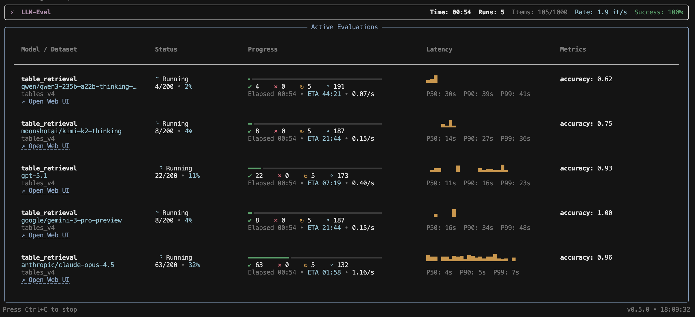
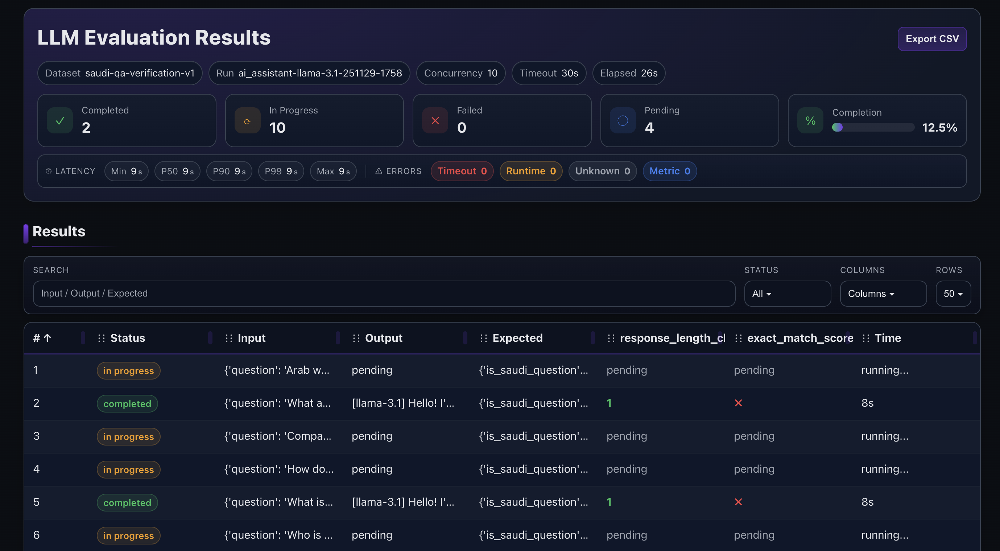
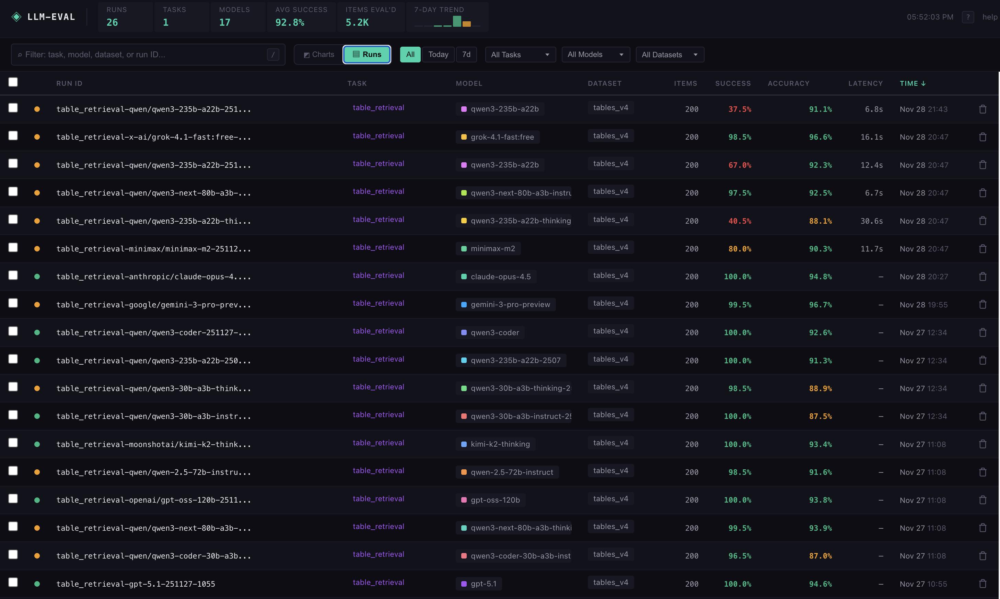
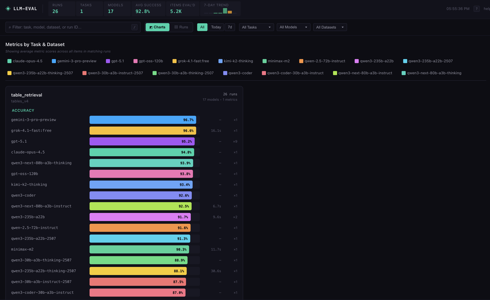

# qym (قيِّم) User Guide

A step-by-step guide to evaluating your LLM applications. Follow this guide carefully to avoid common errors.

## Table of Contents

1. [Installation & Setup](#1-installation--setup)
2. [Understanding the Basics](#2-understanding-the-basics)
3. [Writing Your Task Function](#3-writing-your-task-function)
4. [Using Metrics](#4-using-metrics)
5. [Setting Up Your Dataset](#5-setting-up-your-dataset)
6. [Running Your First Evaluation](#6-running-your-first-evaluation)
7. [Multi-Model Comparison](#7-multi-model-comparison)
8. [Command Line Interface](#8-command-line-interface)
9. [Dashboard & Web UI](#9-dashboard--web-ui)
10. [Understanding Results](#10-understanding-results)
11. [Pause/Resume & Checkpointing](#11-pause-resume--checkpointing)
12. [Configuration Options](#12-configuration-options)
13. [Common Errors & Solutions](#13-common-errors--solutions)

---

## 1. Installation & Setup

### Step 1: Install the package

```bash
pip install qym
```

### Step 2: Set up Langfuse credentials (optional for CSV datasets)

qym integrates with [Langfuse](https://langfuse.com) for dataset storage and tracing. If you're using a **local CSV file** as your dataset, Langfuse credentials are optional—evaluations will run without tracing.

Create a `.env` file in your project root:

```bash
# .env
LANGFUSE_PUBLIC_KEY=pk-lf-xxxxxxxx-xxxx-xxxx-xxxx-xxxxxxxxxxxx
LANGFUSE_SECRET_KEY=sk-lf-xxxxxxxx-xxxx-xxxx-xxxx-xxxxxxxxxxxx
LANGFUSE_HOST=https://cloud.langfuse.com
```

> ⚠️ **Common Error**: If you see `"Missing Langfuse public key"`, your `.env` file is not being loaded. Make sure:
> - The file is named exactly `.env` (not `env` or `.env.txt`)
> - It's in the same directory where you run your script
> - You have `python-dotenv` installed (`pip install python-dotenv`)

### Step 3: Verify setup

```python
from langfuse import Langfuse

client = Langfuse()
print("Connected to Langfuse!")  # If no error, you're ready
```

---

## 2. Understanding the Basics

### How qym Works

```
┌─────────────────────────────────────────────────────────────┐
│                        qym (قيِّم)                            │
│                                                             │
│   Dataset          Your Task         Metrics                │
│   (Langfuse)   →   Function    →    (Scoring)   →  Results  │
│                                                             │
│   100 items        Runs on each      Compares output        │
│   with input       item in parallel  to expected            │
│   & expected                                                │
└─────────────────────────────────────────────────────────────┘
```

### Key Concepts

| Concept | Description |
|---------|-------------|
| **Task** | Your function that takes input and returns output (e.g., calls an LLM) |
| **Dataset** | Collection of test items (Langfuse dataset or local CSV file) |
| **Metrics** | Functions that score your output |
| **Trace** | Langfuse observability object for logging (optional) |

---

## 3. Writing Your Task Function

Your task function is the code being evaluated. qym uses **smart argument resolution** to call your function flexibly.

### How Input is Passed to Your Task

The evaluator looks at your function signature and passes arguments intelligently:

| Your Function | How Evaluator Calls It |
|---------------|------------------------|
| `def task(question)` | `task(question=input_data)` |
| `def task(input_data)` | `task(input_data=input_data)` |
| `def task(x)` | `task(x=input_data)` |
| `def task(q, context)` | `task(q=input["q"], context=input["context"])` if input is dict |
| `def task(q, model_name)` | `task(q=input_data, model_name="gpt-4")` |
| `def task(q, trace_id)` | `task(q=input_data, trace_id="abc-123...")` |
| `def task(**kwargs)` | `task(**input_data, model="gpt-4", trace_id="...")` if input is dict |

**Special parameters** automatically populated by the evaluator:
- `model` or `model_name`: The current model being evaluated
- `trace_id`: The Langfuse trace ID for the current item

### Basic Task (Any Parameter Name Works)

```python
def my_task(question):
    """
    Args:
        question: The 'input' field from your dataset item.
                  Name it whatever you want!

    Returns:
        Any: The output to be evaluated (type depends on your metrics)
    """
    response = call_your_llm(question)
    return response
```

### Task with Dict Input (Auto-Unpacking)

If your dataset input is a dict, parameters are matched by key name:

```python
# Dataset item: {"input": {"question": "What is 2+2?", "context": "Math quiz"}}

def my_task(question, context):
    """Parameters matched to dict keys automatically."""
    prompt = f"Context: {context}\nQuestion: {question}"
    return call_llm(prompt)
```

### Task with Model Routing (For Multi-Model)

When comparing multiple models, add a `model_name` or `model` parameter:

```python
def my_task(question, model_name="gpt-4"):
    """
    Args:
        question: The input
        model_name: Which model to use (passed automatically by Evaluator)
    """
    if model_name == "gpt-4":
        return call_openai(question, model="gpt-4")
    elif model_name == "claude-3":
        return call_anthropic(question)
    else:
        return call_default(question)
```

The evaluator detects `model_name` or `model` parameters and passes the model automatically.

### Task with Trace ID (For Observability)

If you need the Langfuse trace ID for logging or debugging, add a `trace_id` parameter:

```python
def my_task(question, trace_id=None):
    """
    Args:
        question: The input
        trace_id: Langfuse trace ID (passed automatically by Evaluator)
    """
    # Use trace_id for custom logging, linking to external systems, etc.
    print(f"Processing with trace: {trace_id}")

    # You can also pass it to sub-systems for tracing
    result = call_llm(question, metadata={"trace_id": trace_id})
    return result
```

The evaluator automatically detects the `trace_id` parameter and passes the current Langfuse trace ID. This is useful for:
- Linking evaluation results to external logging systems
- Debugging specific items in Langfuse
- Correlating traces across services

### Async Task (Recommended for LLM Calls)

Async tasks enable better concurrency:

```python
async def my_task(question, model_name="gpt-4"):
    """Async tasks are automatically awaited."""
    response = await openai_client.chat.completions.create(
        model=model_name,
        messages=[{"role": "user", "content": question}]
    )
    return response.choices[0].message.content
```

### Task Returning Non-String (For Custom Metrics)

Your task can return any type if you use custom metrics:

```python
def my_task(question):
    """Return a structured response for custom metrics."""
    result = call_llm(question)
    return {
        "answer": result,
        "tokens_used": 150,
        "latency_ms": 230,
    }

# Custom metric that understands the dict
def token_efficiency(output, expected):
    return 1.0 if output["tokens_used"] < 200 else 0.5
```

### ⚠️ Common Task Mistakes

```python
# ❌ WRONG: Returns None (forgot return statement)
def bad_task(question):
    result = call_llm(question)
    # Missing return!

# ❌ WRONG: Exception not handled
def bad_task(question):
    return call_llm(question)  # If this throws, item fails

# ✅ CORRECT: Clear return, handles errors gracefully
def good_task(question, model_name="gpt-4"):
    try:
        result = call_llm(question, model=model_name)
        return str(result)
    except Exception as e:
        return f"Error: {e}"  # Or raise to mark as failed
```

---

## 4. Using Metrics

Metrics determine how well your task performs.

### Built-in Metrics

| Metric Name | What It Does | Returns |
|-------------|--------------|---------|
| `"exact_match"` | Checks if output equals expected exactly | 1.0 or 0.0 |
| `"contains_expected"` | Checks if expected is substring of output | 1.0 or 0.0 |
| `"fuzzy_match"` | Similarity score (Levenshtein-based) | 0.0 to 1.0 |

```python
evaluator = Evaluator(
    task=my_task,
    dataset="my-dataset",
    metrics=["exact_match", "contains_expected"],  # Use strings for built-in
)
```

> ⚠️ **Important**: Built-in metrics compare your task's output to the `expected_output` field in your dataset. If your dataset has no `expected_output`, these metrics will receive `None` and may not work as expected.

### Custom Metrics

A custom metric is a function you define. The evaluator **automatically detects** how many parameters your metric accepts and calls it accordingly.

#### Metric Signatures

```python
# 1-parameter metric: only receives output
def my_metric(output):
    return 1.0 if len(output) > 10 else 0.0

# 2-parameter metric: receives output and expected
def my_metric(output, expected):
    return 1.0 if output == expected else 0.0

# 3-parameter metric: receives output, expected, and input
def my_metric(output, expected, input_data):
    # Can use the original input for evaluation
    return 1.0 if input_data["category"] in output else 0.0
```

#### Parameter Names (Important!)

The parameter **names matter** for keyword argument matching. Use these exact names:

| Position | Parameter Name | What It Contains |
|----------|---------------|------------------|
| 1st | `output` | What your task returned |
| 2nd | `expected` | The `expected_output` from dataset (or `None`) |
| 3rd | `input_data` | The original `input` from dataset |

```python
# ✅ CORRECT: Using standard parameter names
def my_metric(output, expected, input_data):
    ...

# ✅ ALSO CORRECT: Positional matching works with any names
def my_metric(result, ground_truth, question):
    # Works! Matched by position: result=output, ground_truth=expected, question=input_data
    ...

# ⚠️ BE CAREFUL: If using keyword-style, names must match
def my_metric(output, expected):  # OK
def my_metric(output, exp):       # OK (positional)

# ❌ WRONG: Parameters in wrong order
def bad_metric(expected, output):  # Should be (output, expected)!
    return 1.0 if output == expected else 0.0
# This will compare the wrong values!

# ❌ WRONG: Missing expected
def bad_metric(output, input_data):  # Should be (output, expected, input_data)!
    return 1.0 if input_data in output else 0.0
# Do this even if expected is not needed!
```

#### Metric Return Values

Your metric can return:

```python
# Option 1: Just a score (float)
def simple_metric(output, expected):
    return 0.85

# Option 2: Boolean (converted to 1.0 or 0.0)
def bool_metric(output, expected):
    return output == expected  # True/False

# Option 3: Dict with score and metadata (recommended for debugging)
def detailed_metric(output, expected):
    return {
        "score": 0.85,
        "metadata": {
            "output_length": len(output),
            "match_type": "partial",
            "reason": "Missing key details"
        }
    }
```

The metadata appears in your CSV results and Langfuse traces for debugging.

#### Using Custom Metrics with Any Task Output

When using **only custom metrics**, your task can return **any type** (not just strings):

```python
# Task returns a dict
def my_task(question):
    return {
        "answer": "Paris",
        "confidence": 0.95,
        "sources": ["wikipedia"]
    }

# Custom metric handles the dict
def confidence_metric(output, expected):
    # output is the dict returned by the task
    return output["confidence"]  # Returns 0.95

def answer_match(output, expected):
    return 1.0 if output["answer"] == expected else 0.0

evaluator = Evaluator(
    task=my_task,
    dataset="my-dataset",
    metrics=[confidence_metric, answer_match],  # Works with dict output!
)
```

> ⚠️ **Note**: Built-in metrics like `exact_match` expect string outputs. If your task returns non-strings, use custom metrics.

#### Async Metrics

Metrics can be async (useful for LLM-as-judge):

```python
async def llm_judge_metric(output, expected, input_data):
    response = await openai_client.chat.completions.create(
        model="gpt-4",
        messages=[{
            "role": "user",
            "content": f"Rate this answer 0-1:\nQuestion: {input_data}\nAnswer: {output}"
        }]
    )
    return float(response.choices[0].message.content)
```

### Mixing Built-in and Custom Metrics

```python
def has_greeting(output, expected):
    greetings = ["hello", "hi", "hey"]
    return 1.0 if any(g in output.lower() for g in greetings) else 0.0

evaluator = Evaluator(
    task=my_task,
    dataset="my-dataset",
    metrics=["exact_match", has_greeting],  # Mix strings and functions
)
```

### ⚠️ Common Metric Mistakes

```python
# ❌ WRONG: Metric name doesn't exist
metrics=["faithfulness"]  # Not a built-in! Will error.

# ❌ WRONG: Returns wrong type
def bad_metric(output, expected):
    return "good"  # Should return float, bool, or dict with 'score'

# ❌ WRONG: Metric doesn't handle None expected
def bad_metric(output, expected):
    return output == expected  # Crashes if expected is None

# ✅ CORRECT: Right order and handles edge cases
def good_metric(output, expected):
    if expected is None:
        return 1.0 if len(str(output)) > 0 else 0.0
    return 1.0 if output == expected else 0.0
```

---

## 5. Setting Up Your Dataset

### Dataset Structure in Langfuse

Each dataset item must have:

| Field | Required | Description |
|-------|----------|-------------|
| `input` | ✅ Yes | The input to your task (string, dict, or any JSON type) |
| `expected_output` | ⚠️ For built-in metrics | The correct answer for comparison |
| `metadata` | Optional | Extra info (user_id, category, etc.) |

### Creating a Dataset in Langfuse UI

1. Go to your Langfuse project
2. Click **Datasets** → **New Dataset**
3. Name it (e.g., `qa-test-set`)
4. Add items with this structure:

**Simple string input:**
```json
{
  "input": "What is the capital of France?",
  "expected_output": "Paris"
}
```

**Dict input (keys match your task parameters):**
```json
{
  "input": {
    "question": "What is the capital of France?",
    "context": "France is a country in Western Europe."
  },
  "expected_output": "Paris"
}
```

### Creating a Dataset via Python

```python
from langfuse import Langfuse

client = Langfuse()

# Create dataset
dataset = client.create_dataset(name="my-qa-dataset")

# Add items - string input
client.create_dataset_item(
    dataset_name="my-qa-dataset",
    input="What is 2 + 2?",
    expected_output="4"
)

# Add items - dict input
client.create_dataset_item(
    dataset_name="my-qa-dataset",
    input={"question": "Capital of Japan?", "hint": "Starts with T"},
    expected_output="Tokyo"
)
```

### CSV Datasets (Local)

If you already have test cases in a spreadsheet or CSV, you can run evaluations directly from a local `.csv` file—**no Langfuse dataset required**.

**You can use any column names** — you map them when constructing the dataset (Python) or via CLI flags.

#### Required columns

- A column containing the task **input** (you choose its name, then pass it as `input_col` / `--csv-input-col`).

#### Optional columns

- **Expected output** column (for built-in metrics like `exact_match`): pass as `expected_col` / `--csv-expected-col`
- **ID** column: pass as `id_col` / `--csv-id-col` (otherwise IDs are generated as `row_000000`, `row_000001`, ...)
- **Metadata** columns: pass as `metadata_cols` / `--csv-metadata-cols` (we convert them into a JSON object/dict per row)

#### Cell parsing rules (minimal, predictable)

- If a cell starts with `{` or `[`, it is parsed as JSON (dict/list).
- Otherwise it is treated as a string.
- If a `{...}` or `[...]` cell contains invalid JSON, you get a clear error including file, row, and column.

#### Example CSV

Create `datasets/qa.csv`:

```csv
question,answer,category,difficulty
What is 2+2?,4,math,easy
"{""question"":""Capital of Japan?"",""hint"":""Starts with T""}",Tokyo,geo,easy
```

Notes:
- The first row's `question` is a plain string.
- The second row's `question` is a JSON object (so your task can accept dict input).

#### Run via CLI

```bash
qym --task-file agent.py --task-function my_task \
  --dataset-csv datasets/qa.csv \
  --csv-input-col question \
  --csv-expected-col answer \
  --csv-metadata-cols category,difficulty \
  --metrics exact_match
```

#### Run via Python API

```python
from qym import Evaluator, CsvDataset

dataset = CsvDataset(
    "datasets/qa.csv",
    input_col="question",
    expected_col="answer",
    metadata_cols=["category", "difficulty"],
)

evaluator = Evaluator(
    task=my_task,
    dataset=dataset,
    metrics=["exact_match"],
)

results = evaluator.run()
```

**Tracing behavior:** If your Langfuse credentials are set, runs created from CSV will still emit Langfuse traces (useful if your task expects `trace_id`). If credentials are not set, evaluation still runs (without tracing).

### ⚠️ Common Dataset Mistakes

```python
# ❌ WRONG: Dataset name doesn't exist (case-sensitive!)
evaluator = Evaluator(
    dataset="my-dataset",  # Typo! Actual name is "my_dataset"
    ...
)
# Error: "Dataset 'my-dataset' not found"

# ❌ WRONG: Empty dataset
# Error: "Dataset 'test' is empty. Please add items before evaluation."

# ❌ WRONG: Using built-in metrics without expected_output
# exact_match will receive None and may not work as expected
```

---

## 6. Running Your First Evaluation

### Complete Working Example

```python
# example.py
from dotenv import load_dotenv
load_dotenv()  # Load .env file FIRST - this is critical!

from qym import Evaluator

# 1. Define your task (parameter name can be anything)
def simple_task(question, model_name=None):
    """A simple task that echoes the input."""
    # Replace this with your actual LLM call
    return f"You asked: {question}"

# 2. Define a custom metric
def length_check(output, expected):
    """Check if output has reasonable length."""
    return 1.0 if len(str(output)) > 10 else 0.0

# 3. Create evaluator
evaluator = Evaluator(
    task=simple_task,
    dataset="my-qa-dataset",  # Must exist in Langfuse
    metrics=["exact_match", length_check],  # Mix built-in and custom
    config={
        "max_concurrency": 5,  # Run 5 items in parallel
        "run_name": "my-first-eval",
    }
)

# 4. Run evaluation
results = evaluator.run()

# 5. Results are auto-saved to qym_results/ directory
print(f"Success rate: {results.success_rate:.1%}")
print(f"Total items: {results.total_items}")
```

### What Happens When You Run

1. **Dataset loads** (from Langfuse or local CSV)
2. **Dashboard appears** showing live progress (TUI + Web UI)
3. **Items run in parallel** (controlled by `max_concurrency`)
4. **Metrics score** each output
5. **Results save** to CSV automatically
6. **Traces appear** in Langfuse for debugging (if credentials are set)

### The Dashboard

When you run, you'll see:

```
┌─────────────────────────────────────────────────────────────┐
│ qym Dashboard                               Web UI: http://... │
├─────────────────────────────────────────────────────────────┤
│ Run: my-first-eval                                          │
│ Dataset: my-qa-dataset (100 items)                          │
│ Progress: ████████████████████░░░░░░░░░░ 67/100 (67%)       │
│                                                             │
│ Metrics:                                                    │
│   exact_match: 0.45 avg                                     │
│   length_check: 0.98 avg                                    │
│                                                             │
│ Latency: p50=1.2s, p95=3.4s                                 │
└─────────────────────────────────────────────────────────────┘
```

---

## 7. Multi-Model Comparison

### Option A: Single Evaluator with Multiple Models

```python
from qym import Evaluator

async def my_task(question, model_name="gpt-4"):
    # model_name is automatically passed by the Evaluator
    return await call_llm(model_name, question)

evaluator = Evaluator(
    task=my_task,
    dataset="my-dataset",
    metrics=["exact_match"],
    model=["gpt-4", "gpt-3.5-turbo", "claude-3-sonnet"],  # List of models
)

# Runs all 3 models in parallel on the same dataset
results = evaluator.run()  # Returns list of 3 EvaluationResult objects
```

### Option B: run_parallel for Different Tasks

```python
from qym import Evaluator

results = Evaluator.run_parallel(
    runs=[
        {
            "name": "QA Evaluation",
            "task": qa_task,
            "dataset": "qa-dataset",
            "metrics": ["exact_match"],
            "models": ["gpt-4", "claude-3"],  # 2 models × this task
            "config": {"max_concurrency": 10},
        },
        {
            "name": "Summarization",
            "task": summarize_task,
            "dataset": "docs-dataset",
            "metrics": ["contains_expected"],
            "models": ["gpt-4"],  # 1 model × this task
        },
    ],
    show_tui=True,  # Show live dashboard
    auto_save=True,  # Save results to CSV
)

# Total runs: 2 + 1 = 3 parallel evaluations
```

### Model Parameter in Your Task

When using `model=["gpt-4", "claude-3"]`, the evaluator calls your task with:

```python
# For first model:
my_task(question, model_name="gpt-4")

# For second model:
my_task(question, model_name="claude-3")
```

Make sure your task accepts `model_name` or `model` parameter!

---

## 8. Command Line Interface

### Basic Usage

```bash
# Evaluate a function from a file
qym --task-file agent.py --task-function my_task \
         --dataset qa-dataset \
         --metrics exact_match
```

### All CLI Options

```bash
qym \
    --task-file agent.py \           # Python file containing your task
    --task-function my_task \         # Function name to call
    --dataset qa-dataset \            # Langfuse dataset name
    --metrics exact_match,fuzzy_match \ # Comma-separated metrics
    --model gpt-4 \                   # Optional: tag with model name
    --concurrency 10 \                # Max parallel items (default: 10)
    --output results.csv \            # Custom output path
    --no-tui \                        # Disable terminal dashboard
    --quiet                           # Only show final summary
```

### Multi-Run Config File

Create `experiments.json`:

```json
[
  {
    "name": "gpt4-qa",
    "task_file": "agent.py",
    "task_function": "answer_question",
    "dataset": "qa-dataset",
    "metrics": ["exact_match"],
    "config": {
      "model": "gpt-4",
      "max_concurrency": 5
    }
  },
  {
    "name": "claude-qa",
    "task_file": "agent.py",
    "task_function": "answer_question",
    "dataset": "qa-dataset",
    "metrics": ["exact_match"],
    "config": {
      "model": "claude-3",
      "max_concurrency": 5
    }
  }
]
```

Run all experiments:

```bash
qym --runs-config experiments.json
```

### Resume a Partial Run

If a run is interrupted, qym writes a checkpoint CSV as items complete. Resume by pointing to the checkpoint file:

```bash
qym resume --run-file qym_results/my_task/my_model/2026-01-27/my_task-my_dataset-my_model-260127-1200.csv \
  --task-file agent.py --task-function my_task \
  --dataset my-dataset --metrics exact_match
```

Resume requirements:
- Use the same dataset and metrics as the original run.
- Point to the exact checkpoint CSV for that run.
- `resume_from` automatically reuses the checkpoint run_id (no need to set `run_name`).

Where to find the checkpoint file:
- The checkpoint is the same CSV under `qym_results/...` and is updated as items finish.
- On interrupt, qym prints the checkpoint path in the terminal.

Resume via Python API:

```python
from qym import Evaluator

evaluator = Evaluator(
    task=my_task,
    dataset="my-dataset",
    metrics=["exact_match"],
    config={
        "resume_from": "qym_results/.../run.csv",
    },
)

results = evaluator.run()
```

Multi-model resume:
- Resume is per-run. Use the specific run CSV for the model you want to resume.
- If using a `--runs-config`, set `resume_from` inside each run’s config block.

---

## 9. Dashboard & Web UI

qym provides two interfaces for monitoring evaluations: a Terminal UI (TUI) for quick command-line monitoring, and a full-featured Web UI for detailed analysis.

### Terminal UI (TUI)

When you run an evaluation, the TUI shows real-time progress in your terminal:



**Features:**
- Multiple parallel evaluation tracking
- Progress bars with completion percentage
- Live latency histograms (P50, P90, P99)
- Real-time metric scores
- ETA estimation
- Items per second throughput

Control the TUI with the `show_tui` parameter:

```python
results = evaluator.run(
    show_tui=True,   # Show terminal dashboard (default)
    auto_save=True,
)
```

### Web Dashboard

There are two ways to access the Web UI:

#### 0. Deployed Platform (remote live dashboard)

In addition to the local web UI, `qym` can stream run events to a **deployed platform** that hosts:
- a centralized historical runs dashboard
- the live run UI (served by the platform, not your laptop)

To enable streaming, provide the platform URL and API key (args or env vars):
- `--platform-api-key` / `QYM_API_KEY`

The platform URL is treated as an internal default. For dev/test only, you can override it with:
- `--platform-url` or `QYM_PLATFORM_URL`

Example:

```bash
qym --task-file examples/example.py --task-function my_task \
  --dataset-csv examples/my_dataset.csv \
  --metrics exact_match \
  --platform-url http://localhost:8000 \
  --platform-api-key <YOUR_API_KEY>
```

To upload a saved results artifact (offline/backfill):

```bash
qym submit --file path/to/results.csv \
  --platform-url http://localhost:8000 \
  --api-key <YOUR_API_KEY> \
  --task my_task --dataset my_dataset --model my_model
```

#### 1. Live Evaluation UI (Per-Run)

When you start an evaluation, a **live Web UI** is automatically launched for that run. You'll see a clickable link in the terminal output:

```
🌐 Open Web UI: http://127.0.0.1:8000/
```

Click this link (or Cmd/Ctrl+click in most terminals) to open the live dashboard in your browser. This shows real-time progress for the current evaluation.



**Features:**
- Real-time progress tracking
- Status indicators (completed, in progress, pending, failed)
- Live metric scores
- Latency statistics (min, P50, P90, P99, max)
- Error breakdown by type
- Search and filter results
- Export to CSV

#### 2. Platform Dashboard (Recommended)

To browse **all evaluation runs**, use the dashboard CLI command:

```bash
qym dashboard
```

This opens the platform dashboard in your browser where you can view, filter, compare, and analyze all runs.

> **Note**: The local dashboard server has been deprecated. All dashboard functionality is now provided by the deployed platform. You'll need:
> - `QYM_PLATFORM_URL` (or use the built-in default)
> - `QYM_API_KEY` for uploading runs

#### Historical Runs View

Browse all past evaluation runs with powerful filtering:



**Features:**
- Filter by task, model, dataset, or time range
- Sort by any column (accuracy, latency, time)
- View run statistics at a glance
- Select multiple runs for comparison
- 7-day trend visualization

#### Run Comparison

Compare multiple runs side-by-side to identify the best model:


**How to compare:**
1. In the Historical Runs view, check the boxes next to runs you want to compare
2. Click the "Compare Selected" button
3. View the comparison dashboard

**Comparison Features:**
- Side-by-side run statistics
- Metric averages comparison with bar charts
- Winner breakdown showing which model won most items
- Correct distribution (how many runs solved each item)

**Comparison Overview Metrics:**
- **Pass@K**: % of items where at least one run passed
- **Pass^K**: % of items where all runs passed
- **Max@K**: Average of best scores per item
- **Stability**: % of items where all runs got the same score
- **Avg Score**: Mean score across all items and runs
- **Avg Latency**: Mean response time

Each metric has an info icon (ⓘ) with a detailed tooltip explanation.

**Threshold for Continuous Metrics:**
For metrics with scores between 0-100 (not just 0 or 1), a "Pass if ≥" slider appears. This lets you define what score counts as "passing" (default: 80%). Boolean metrics (0/1 scores) automatically use 100% as the pass threshold.

#### Item-by-Item Comparison

Drill down into individual items across runs:


**Features:**
- View each input with expected output
- See each model's response side-by-side
- 5-color score scale: green (90%+) → lime (75%+) → yellow (60%+) → orange (40%+) → red (<40%)
- Filter by winner, "All Runs Correct", "No Run Correct", or unique solves
- Identify items that only specific models solved

#### Charts View

Visualize model performance across all runs:



**Features:**
- Bar chart comparison of accuracy by model
- Grouped by task and dataset
- Filter by time range, task, model, or dataset
- Quickly identify top-performing models

### Dashboard Data Storage

The platform dashboard stores all runs in a central database. When you run evaluations with platform streaming enabled (`QYM_API_KEY`), runs are automatically stored on the platform.

For local development, results are also saved to `qym_results/` directory in your **current working directory**:

```
my-project/                    # Run from here!
├── qym_results/               # Results saved here
│   └── {task}/
│       └── {model}/
│           └── {date}/
│               └── {run_name}.csv
├── my_task.py
└── .env
```

You can upload saved results to the platform using:

```bash
qym submit --file path/to/results.csv --task my_task --dataset my-dataset
```

> **Note**: Uploaded files are parsed and ingested into the database. Raw uploaded files are NOT stored persistently.

### Publishing

Confluence publishing has been removed. Share results by linking to the dashboard/compare views and exporting results (CSV/JSON) as needed.

---

## 10. Understanding Results

### Output Files

Results are saved to `qym_results/{task}/{model}/{date}/` in your **current working directory**:

```
qym_results/
└── my_task/
    └── gpt-4/
        └── 2024-01-15/
            └── my_task-qa-dataset-gpt-4-240115-1430.csv
```

> **Tip**: Always run your evaluation scripts from your project root so results and dashboard stay in sync.

### CSV/Excel Columns

| Column | Description |
|--------|-------------|
| `item_id` | Unique identifier for the dataset item |
| `input` | The input sent to your task |
| `item_metadata` | Metadata from the dataset item (JSON) |
| `output` | What your task returned |
| `expected_output` | The expected answer from dataset |
| `{metric}_score` | Score for each metric (e.g., `exact_match_score`) |
| `time` | Latency in seconds |
| `trace_id` | Langfuse trace ID for debugging |

### Export Formats

Results can be saved in three formats:
- **CSV** (default): Standard comma-separated values
- **JSON**: Full structured data with all metadata
- **XLSX**: Excel spreadsheet

### Programmatic Access

```python
results = evaluator.run()

# Overall stats
print(f"Total: {results.total_items}")
print(f"Success rate: {results.success_rate:.1%}")
print(f"Duration: {results.duration:.1f}s")

# Per-metric stats
for metric in results.metrics:
    stats = results.get_metric_stats(metric)
    print(f"{metric}: mean={stats['mean']:.3f}, std={stats['std']:.3f}")

# Timing stats
timing = results.get_timing_stats()
print(f"Avg latency: {timing['mean']:.2f}s")
```

---

## 11. Pause/Resume & Checkpointing

qym can persist **partial results** while a run is in progress and resume later if the process stops (Ctrl+C, crash, or kill).

### How it works

- A checkpoint CSV is written **per completed item** (append-only).
- The checkpoint file is also a normal run file, so it appears in the dashboard.
- Resume skips any `item_id` already present in the checkpoint file.

### CLI behavior on interrupt

On Ctrl+C, qym prints a resume command with the checkpoint path:

```
Partial results saved to qym_results/.../run.csv
Resume with: qym resume --run-file qym_results/.../run.csv ...
```

### Configuration fields

```python
config = {
    "checkpoint_enabled": True,
    "checkpoint_format": "csv",
    "checkpoint_flush_each_item": True,
    "checkpoint_fsync": False,   # Set True for extra durability (slower)
    "resume_from": "qym_results/.../run.csv",
    "interrupt_grace_seconds": 2.0,
}
```

### Notes

- Resume appends to the **same run file** and **same run_id**.
- Completed items (including errors) are skipped on resume.
- `resume_rerun_errors` is not supported when appending to the same run file.

## 12. Configuration Options

### Full Config Reference

```python
evaluator = Evaluator(
    task=my_task,
    dataset="my-dataset",
    metrics=["exact_match"],
    model="gpt-4",  # Or list: ["gpt-4", "claude-3"]
    config={
        # Execution
        "max_concurrency": 10,     # Parallel items (default: 10)
        "timeout": 30.0,           # Seconds per item (default: 30)

        # Naming
        "run_name": "experiment-1", # Custom run name
        "run_metadata": {           # Extra metadata for traces
            "version": "1.0",
            "environment": "staging",
        },

        # Output
        "output_dir": "./results",  # Where to save files

        # Langfuse (override env vars)
        "langfuse_public_key": "pk-...",
        "langfuse_secret_key": "sk-...",
        "langfuse_host": "https://cloud.langfuse.com",
    }
)
```

### run() Options

```python
results = evaluator.run(
    show_tui=True,           # Show terminal UI dashboard (default: True)
    auto_save=True,          # Save results automatically (default: True)
    save_format="csv",       # "csv", "json", or "xlsx" (default: "csv")
    max_parallel_runs=None,  # For multi-model: control parallel execution (see below)
)
```

> **Note**: The Web UI is always available at the URL printed at startup.

### run_parallel() Options

```python
results = Evaluator.run_parallel(
    runs=[...],
    show_tui=True,          # Show terminal UI dashboard (default: True)
    auto_save=True,         # Save each run's results
    save_format="csv",      # "csv", "json", or "xlsx"
    max_parallel_runs=None, # Control how many runs execute at once (see below)
)
```

> **Note**: The Web UI is always available at the URL printed at startup.

### Controlling Parallel Runs (Queue Mode)

When running many evaluations (e.g., 5 tasks × 6 models = 30 runs), you may want to limit how many run at once to avoid overwhelming your API or system.

```python
# Run all at once (default behavior)
results = Evaluator.run_parallel(runs=runs_config)

# Run sequentially - one at a time (queue mode)
results = Evaluator.run_parallel(runs=runs_config, max_parallel_runs=1)

# Run 3 at a time (balanced)
results = Evaluator.run_parallel(runs=runs_config, max_parallel_runs=3)
```

| `max_parallel_runs` | Behavior |
|---------------------|----------|
| `None` (default) | All runs execute simultaneously |
| `1` | Sequential queue - one run at a time |
| `N` | Up to N runs execute at once |

> **Tip**: Use `max_parallel_runs=1` for overnight batch jobs where you want predictable, sequential execution without overwhelming API rate limits.

---

## 13. Common Errors & Solutions

### "Dataset 'X' not found"

```
DatasetNotFoundError: Dataset 'my-dataset' not found.
Available datasets: qa-set, test-data, ...
```

**Solution**: Check the exact dataset name in Langfuse. Names are case-sensitive.

### "Missing Langfuse public key"

```
LangfuseConnectionError: Missing Langfuse public key.
```

**Solution**:
1. Create `.env` file with credentials
2. Add `from dotenv import load_dotenv; load_dotenv()` at the **top** of your script
3. Or export environment variables directly

### "Metric 'X' not found"

```
ValueError: Unknown metric: 'faithfulness'
```

**Solution**: Use only built-in metrics: `exact_match`, `contains_expected`, `fuzzy_match`. Or pass a custom function.

### "Task returned None"

Your task function doesn't return anything.

**Solution**: Add `return` statement to your task.

### "Rate limit exceeded" / Timeouts

Your LLM provider is throttling requests.

**Solution**:
```python
config={
    "max_concurrency": 3,  # Reduce from 10
    "timeout": 60.0,       # Increase timeout
}
```

### Results show all zeros / ERROR

Metric is failing silently.

**Solution**: Check your metric handles `None` expected values:
```python
def my_metric(output, expected):
    if expected is None:
        return 1.0  # Or whatever makes sense
    return 1.0 if output == expected else 0.0
```

---

## Quick Reference

```python
from dotenv import load_dotenv
load_dotenv()  # Optional for CSV datasets

from qym import Evaluator, CsvDataset

# Minimal example (Langfuse dataset)
evaluator = Evaluator(
    task=lambda x: f"Response: {x}",
    dataset="my-dataset",
    metrics=["exact_match"],
)
results = evaluator.run()

# CSV dataset example (no Langfuse required)
evaluator = Evaluator(
    task=my_task,
    dataset=CsvDataset("data.csv", input_col="question", expected_col="answer"),
    metrics=["exact_match"],
)
results = evaluator.run()

# Multi-model example
evaluator = Evaluator(
    task=my_task,
    dataset="my-dataset",
    metrics=["exact_match", my_custom_metric],
    model=["gpt-4", "claude-3"],
    config={"max_concurrency": 5},
)
results = evaluator.run()

# Parallel runs example
results = Evaluator.run_parallel(
    runs=[
        {"name": "Run1", "task": task1, "dataset": "ds1", "metrics": ["exact_match"]},
        {"name": "Run2", "task": task2, "dataset": "ds2", "metrics": ["fuzzy_match"]},
    ],
    auto_save=True,
)
```

---

**Need help?** Check the [examples/](../examples/) directory for complete working scripts.
